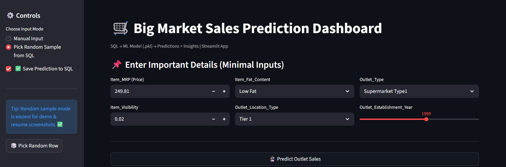
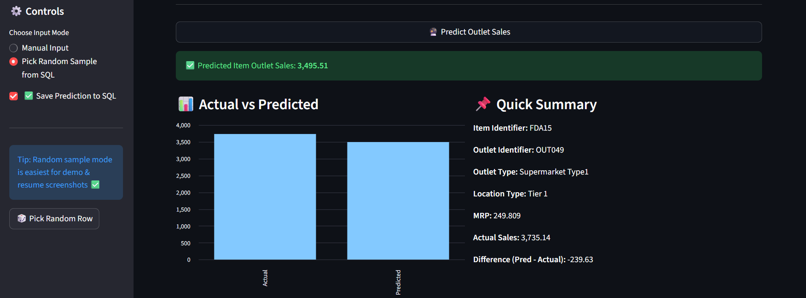
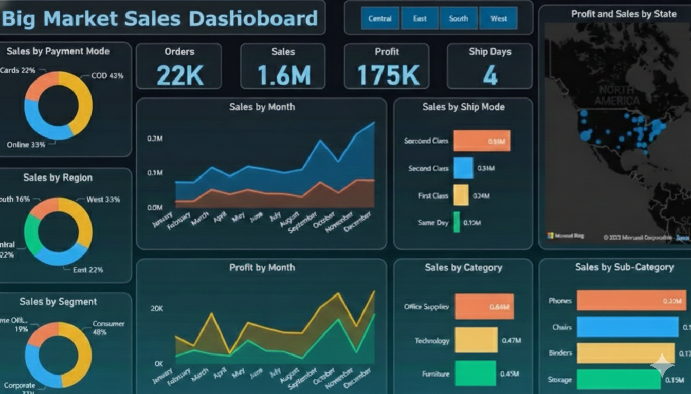

# 🛒 Big Market Sales ML Pipeline (CSV → SQL → ML → Predictions → Dashboard)

🚀 **End-to-End Automated Data + ML Pipeline** built using **Python, MySQL, XGBoost, Streamlit, and Power BI**.  
This project simulates a real-world retail forecasting system where raw CSV data is ingested into SQL daily, used for ML predictions, and visualized in dashboards.

---

## 📌 Why this Project?
✅ Many companies need automated workflows where:
- daily data is updated in a database  
- ML model generates predictions on the latest data  
- business users view results through dashboards/apps  

This project shows exactly that workflow.

---

## ✨ Key Features
✅ CSV → MySQL ingestion (ETL)  
✅ Automated model training + prediction pipeline  
✅ Predictions stored back into SQL  
✅ Streamlit app for interactive sales prediction  
✅ Power BI dashboard for business insights  
✅ Task Scheduler automation (Daily pipeline run)

---

## 🧱 Architecture (Workflow)

```text
Raw CSV (Train.csv)
      ↓
ETL Script (Python)
      ↓
MySQL Database (sales_data)
      ↓
ML Training (XGBoost)
      ↓
Saved Model Artifact (.pkl)
      ↓
Prediction Script
      ↓
MySQL Table (sales_predictions)
      ↓
Power BI Dashboard / Streamlit App


## 🌐 Streamlit App (Input Screen)


## ✅ Streamlit App (Prediction Output)


## 📊 Power BI Dashboard Preview

